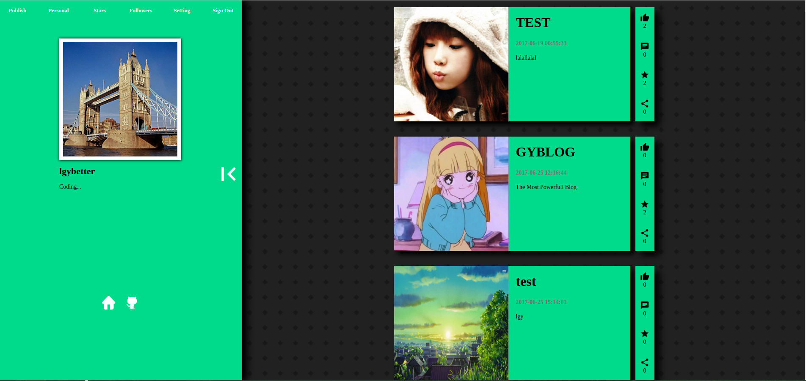
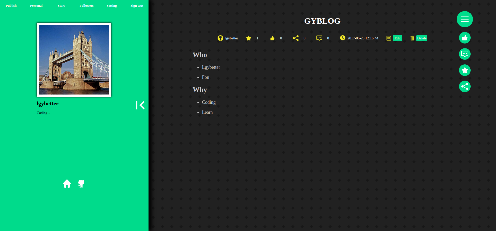
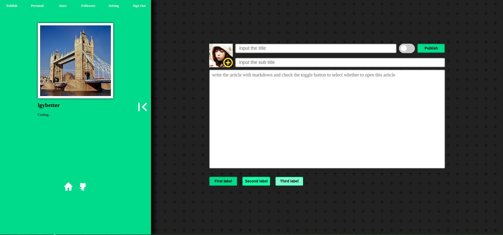
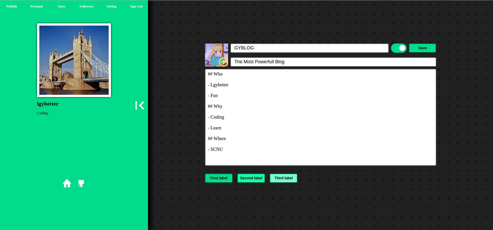
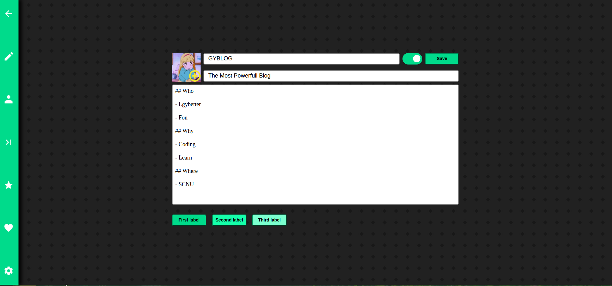
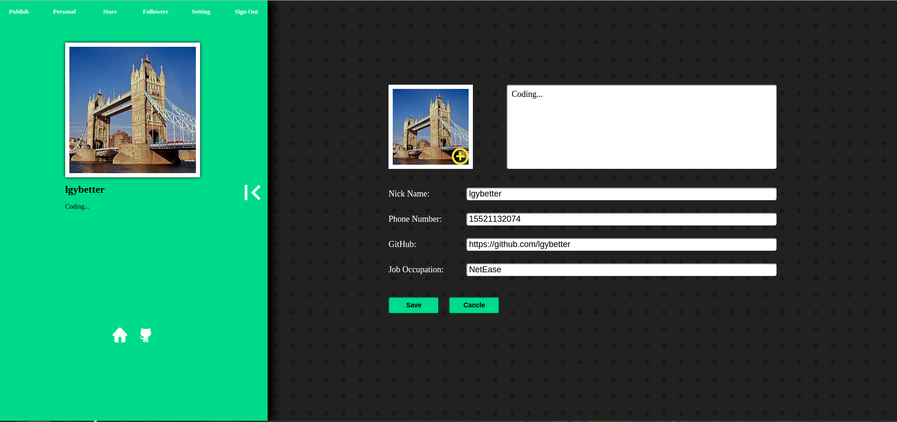
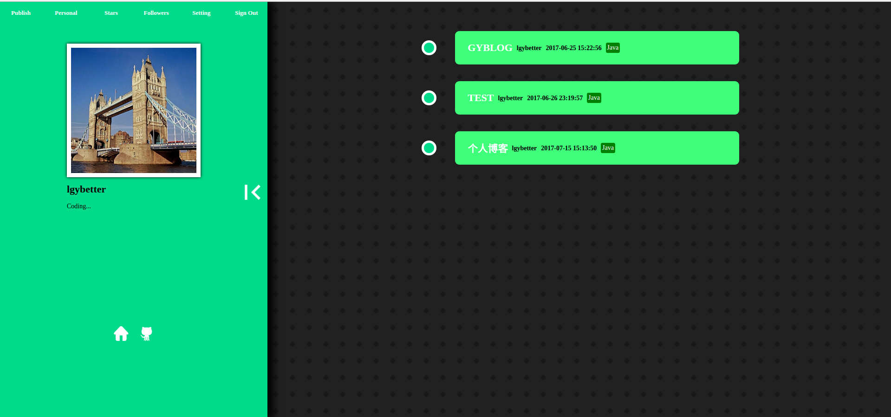

# Gy Blog

## 技术依赖

### 前端
- Vue 全家桶
- Sass

### 后端
- Express
- MongoDB

### 测试
- Mocha

## 运行

### 前端

- 开发模式

```bash
cd app
npm run dev
```
- 生产编译

```bash
cd app
npm run build
```

### 后端

- 开发模式
```bash
mongod --dbpath ... --logpath ... --fork
npm start
```

- 生产模式
```bash
mognod --file ...
pm2 start pm2_config.json
```

## 运行效果

主页


文章浏览


发布文章


编辑器


导航栏


设置


收藏



